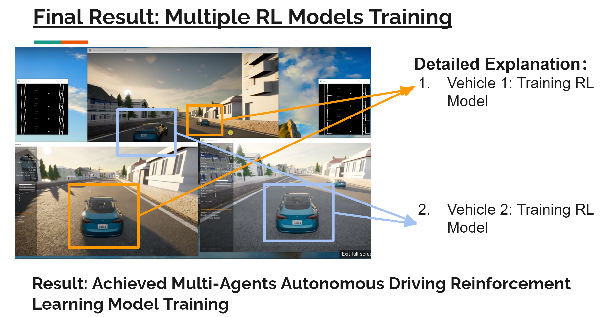
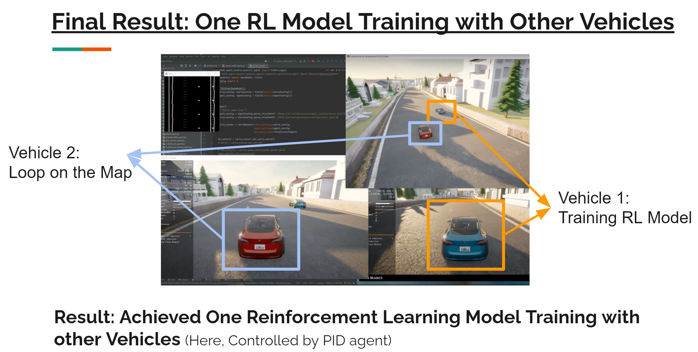

# Robot Open Autonomous Racing (ROAR) - Multi-Agent Support
The existing code base(ROAR_Sim) developed for the ROAR project mainly focuses on the interaction between one vehicle and the environment. Reinforcement learning model is hard to converge. 
To help RL model converge, I provide the solution: Multi-Agents RL Model Training.

In this project,I implemented multi-agents training solution in one world (Berkeley Minor Map).
- Support multiple RL agents training.
- Support one RL agent training with other vehicles (not RL agents).


Other things for readme:
1. stable_baseline3 modification
2. requirements installation  -->  regenerate one.
## Quick Start
### Step 1: Download the Berkeley minor map
- The zip file is [available here](https://drive.google.com/file/d/1hyI9SyjxFG7IV-c6RQxz26fs5LijRogY/view?usp=sharing). 
- Please make sure **you download the engine from this link**, since there are multiple carla version and engines within ROAR project.
- Please download it to a disk with more than 10GB available spaces, and then unzip the file.
- After that, you can get a `Carla` folder.

### Step 2: Install Anaconda
https://docs.anaconda.com/anaconda/install/index.html

### Step 3: Install Dependencies
```
git clone https://github.com/Allison-1999/ROAR.git ROAR1
git clone https://github.com/Allison-1999/ROAR.git ROAR2

Build environment and install packages
cd ROAR1
conda create -n roar_multi_rl_client_3.7.7 python=3.7.7
conda activate roar_multi_rl_client_3.7.7
pip install -r multi_clients_requirements.txt

Open your PyCharm USING `RUN AS ADMINISTRATION` (Otherwise, the model saving will fail)
And open the ROAR1 and ROAR2 projects in two PyCharm windows

After installing the packages, to run e2eModel, please change the stable_baseline3.
You can choose to enter the `\.conda\envs\ROAR\Lib\site-packages` directory, delete the `stable_baselines3-1.5.0.dist-info` and `stable_baselines3` folders and then copy the two folders with the same names under `ROAR\package_stable_baselines3` to `\.conda\envs\ROAR\Lib\site-packages` directory instead.
Otherwise, you can edit the package manually by checking the instruction on the top section of `ROAR_gym/e2eModel.py`, which was written by the group member who is responsible for RL model training.

change spawn_point_id in ROAR_gym/configurations/agent_configuration.json line 60, set 0 for ROAR1 and set 1 for ROAR2
with its context should be:

for ROAR1:
    "enable_autopilot": true,
    "spawn_point_id": 0,
    "show_sensors_data": true,
    "save_sensor_data": false

for ROAR2:
    "enable_autopilot": true,
    "spawn_point_id": 1,
    "show_sensors_data": true,
    "save_sensor_data": false
    
    [NOTICE] In the Berkeley minor map, the spawn points are too close to each other. 
    So even when you set different spawn points, you may still get the `ValueError: Cannot spawn actor at ID [1]. Error: Spawn failed because of collision at spawn position`\
    In that case, please make sure you start one client first, and start the second client a few second later.
    
    In this case, you may also need to restart the UE4 engine, since the vehicle from a previous failure client may still remain in the simulation world and hold the spawn point.
    
also change the `"run_name"` in the following file: ROAR_gym/configurations/ppo_configuration.py
for ROAR1:
misc_params = {
  "env_name": 'roar-e2e-ppo-v0',
  "run_fps": 8,  # TODO Link to the environment RUN_FPS
  "model_directory": Path("./output/PPOe2e_Run_1"),
  "run_name": "ROAR1",
  "total_timesteps": int(1e6),
}

for ROAR2:
misc_params = {
  "env_name": 'roar-e2e-ppo-v0',
  "run_fps": 8,  # TODO Link to the environment RUN_FPS
  "model_directory": Path("./output/PPOe2e_Run_1"),
  "run_name": "ROAR2",
  "total_timesteps": int(1e6),
}

if you got the following error, please change the `"run_name"` to a new string that never been used, for instance, you can append your nickname to it.
wandb: Currently logged in as: jingjingwei. Use `wandb login --relogin` to force relogin
wandb: ERROR Error while calling W&B API: Error 1062: Duplicate entry '908467-Run 1' for key 'PRIMARY' (<Response [409]>)


then, change the ROAR_gym/configurations/wandb_configuration.json file, set different run id. Set 1 for ROAR1, and set 2 for ROAR 2
for ROAR1:
{"run_id": "ROAR1, "name": "", "project_name": "ROAR", "entity": "jingjingwei"}
for ROAR2:
{"run_id": "ROAR2", "name": "", "project_name": "ROAR", "entity": "jingjingwei"}


then, set the API key for wandb
(login and input the API key)

https://docs.wandb.ai/quickstart
`pip install wandb`
`wandb login a20e04de52982c4c0293909e28070b1338acba5e`
```

## Result
### 1.Multiple RL models training
- Demo Video: https://youtu.be/laiqscH3D54


### 2. One RL model training with other vehicles
- Demo video: https://youtu.be/vcN-FdV7lzo


## Future Work
1. Redesign the reward of RL model to achieve:
- Train multiple RL agents to speed up model converge (Helpful for more complicated map -> Berkeley Major Map)
- Train one RL agent that can avoid collide with other vehicles.
2. Multiple vehicles racing
## Reference
[1] Dosovitskiy, A., Ros, G., Codevilla, F., Lopez, A., & Koltun, V. (2017). Carla: An open urban driving simulator. In Conference on robot learning (pp. 1–16).
[2] Python API - CARLA Simulator. (2022). Retrieved 8 May 2022, from https://carla.readthedocs.io/en/latest/python_api
