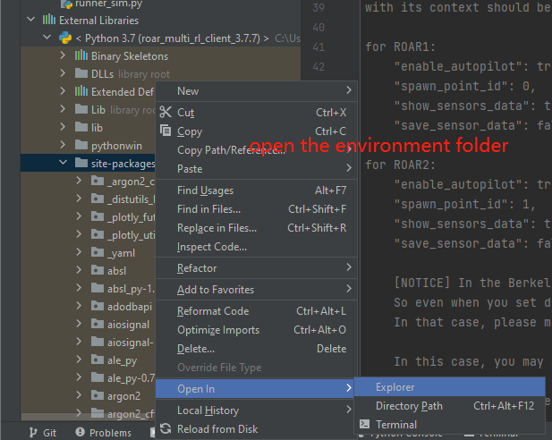

# Robot Open Autonomous Racing (ROAR) - Multi-Agent RL Model Training Support
The existing code base(ROAR_Sim) developed for the ROAR project mainly focuses on the interaction between one vehicle and the environment. Reinforcement learning model is hard to converge. 
To help RL model converge, I provide the solution: Multi-Agents RL Model Training.

In this project,I implemented multi-agents training solution in one world (Berkeley Minor Map).
- Support multiple RL agents training.
- Support one RL agent training with other vehicles (not RL agents).
## Author
**Jingjing Wei (jingjingwei@berkeley.edu)**\
If you encountered any problems during configuration and running the script, please feel free to contact me.


# Quick Start
## Step 1: Download the Berkeley minor map
- The zip file is [available here](https://drive.google.com/file/d/1hyI9SyjxFG7IV-c6RQxz26fs5LijRogY/view?usp=sharing). 
- Please make sure **you download the engine from this link**, since there are multiple carla version and engines within ROAR project.
- Please download it to a disk with more than 10GB available spaces, and then unzip the file.
- After that, you can get a `Carla` folder.


## Step 2: Install Anaconda
https://docs.anaconda.com/anaconda/install/index.html

Then open an `Anaconda Powershell Prompt` Terminal

## Step 2: Clone repo to local
To simplify the configuration, please clone two repo to your local, with ROAR1 and ROAR2 as their folder name.
```
git clone https://github.com/Allison-1999/ROAR.git ROAR1
git clone https://github.com/Allison-1999/ROAR.git ROAR2
```

## Step 3: Build environment and Install Dependencies
### 1. Build environment
```
cd ROAR1
conda create -n roar_multi_rl_client_3.7.7 python=3.7.7
conda activate roar_multi_rl_client_3.7.7
pip install -r multi_clients_requirements.txt
```
Please be patient during the installation, the terminal will take around 5-10 mins to install packages. And may spend several minutes in the following step.


### 2. Open the projects using admin mode
Open your PyCharm USING **`RUN AS ADMINISTRATION`** (Otherwise, the model saving will fail)
And open the `ROAR1` and `ROAR2` projects separately in two PyCharm windows using `open`.
Please select open in new window to get two PyCharm windows.\
\
Please notice that don't let PyCharm create the virtual environment. Please press `Cancel` if see the following dialog.\
\
Your PyCharm should look like the following image\


### 3. Configure the environment for PyCharm
Please select the environment you created in the `Step 3.1 Build environment` for both `ROAR1 PyCharm window` and `ROAR2 PyCharm window`.\
\
Then, please wait for the indexing.


### 4. Modify the environment
After configuring the environment, to run e2eModel, please change the stable_baseline3.\
The easiest way is to enter the `\.conda\envs\ROAR\Lib\site-packages` directory, delete the `stable_baselines3-1.5.0.dist-info` and `stable_baselines3` folders and then copy the two folders with the same names under `ROAR\package_stable_baselines3` to `\.conda\envs\ROAR\Lib\site-packages` directory instead.\
\
Otherwise, you can edit the package manually by checking the instruction on the top section of `ROAR_gym/e2eModel.py`, which was written by the group member who is responsible for RL model training.


### 5. Prepare to run - wandb config
Before starting, please set the API key for wandb. wandb is integrated by other team member to see the training process.\
I provided my API key as follows. It's fine for running a demo, but if you want to train your own model, please register a new one.\
For more information, please check [https://docs.wandb.ai/quickstart](https://docs.wandb.ai/quickstart)
```
pip install wandb
wandb login a20e04de52982c4c0293909e28070b1338acba5e
```
If you are using your own wandb account, please also change the `project_name` and `entity` in `ROAR_gym/configurations/wandb_configuration.json` file

### 6. Prepare to run - change run id and spawn point id
Change `spawn_point_id` in `ROAR_gym/configurations/agent_configuration.json` `line 60`, set 0 for ROAR1 and set 1 for ROAR2
with its context should be:
```
for ROAR1:
    "enable_autopilot": true,
    "spawn_point_id": 0,
    "show_sensors_data": true,
    "save_sensor_data": false

for ROAR2:
    "enable_autopilot": true,
    "spawn_point_id": 1,
    "show_sensors_data": true,
    "save_sensor_data": false

```
```
[NOTICE] In the Berkeley minor map, the spawn points are too close to each other. 
So even when you set different spawn points, you may still get the `ValueError: Cannot spawn actor at ID [1]. Error: Spawn failed because of collision at spawn position`\
In that case, please make sure you start one client first, and start the second client a few second later.
In this case, you may also need to restart the UE4 engine, since the vehicle from a previous failure client may still remain in the simulation world and hold the spawn point.
```
Then, change the `"run_name"` in the following file: `ROAR_gym/configurations/ppo_configuration.py`.
Please change the `"run_name"` to a new string that never been used, for instance, you can append your nickname to it (`<Nickname>_ROAR1`, `<Nickname>_ROAR2`)
```
for ROAR1:
misc_params = {
  "env_name": 'roar-e2e-ppo-v0',
  "run_fps": 8,  # TODO Link to the environment RUN_FPS
  "model_directory": Path("./output/PPOe2e_Run_1"),
  "run_name": "ROAR1",  # <------------change this line
  "total_timesteps": int(1e6),
}

for ROAR2:
misc_params = {
  "env_name": 'roar-e2e-ppo-v0',
  "run_fps": 8,  # TODO Link to the environment RUN_FPS
  "model_directory": Path("./output/PPOe2e_Run_1"),
  "run_name": "ROAR2",  # <------------change this line
  "total_timesteps": int(1e6),
}
```    

After that, you also need to update the `ROAR_gym/configurations/wandb_configuration.json` file, and set different `run_id`.
```
for ROAR1:
{"run_id": "ROAR1, "name": "", "project_name": "ROAR", "entity": "jingjingwei"}
for ROAR2:
{"run_id": "ROAR2", "name": "", "project_name": "ROAR", "entity": "jingjingwei"}
```


If you don't change the run_name to a unique key, you will get the following error when saving the model.
`wandb: ERROR Error while calling W&B API: Error 1062: Duplicate entry '908467-Run 1' for key 'PRIMARY' (<Response [409]>)`

### 7. Start Running

#### First, Open the UE4 Engine
Please open the CarlaUE4 you got in the first step.


#### Second, Run the two projects one by one
Please open the file `ROAR_gym/e2eModel.py`\
Then find the green run button, and run the `e2eModel.py` script of `ROAR1` and `ROAR2` one by one in PyCharm.


## Result
### 1.Multiple RL models training
- Demo Video: https://youtu.be/laiqscH3D54

- This validated that multiple RL training can be started in the same world though multi-client.

### 2. One RL model training with other vehicles
If you want to get this results, please run the `ROAR_gym/e2eModel.py` script of `ROAR1` and `runner_sim.py` script of `ROAR2`.
- Demo video: https://youtu.be/vcN-FdV7lzo

- This validated that one RL training can be started with other agents in the same world though multi-client.


## Common Problems:
[1] If you see the following errors:
`ValueError: Cannot spawn actor at ID [1]. Error: Spawn failed because of collision at spawn position`. 

It may caused by:
1. A vehicle from previous killed client occupy the position. Please close your CarlaUE4 using Task Manager. 
2. You start the `ROAR1` and `ROAR2` at the same spawn point. Please check the spawn point discribed in the Step 3.6 and start two script one by one.

[2] If you see the following errors:
`wandb: ERROR Error while calling W&B API: Error 1062: Duplicate entry '908467-Run 1' for key 'PRIMARY' (<Response [409]>)`
Then please use a unqiue run_id and run_name as described in Step 3.6

[3] If you see the following errors:
```RuntimeError: time-out of 2000ms while waiting for the simulator, make sure the simulator is ready and connected to 127.0.0.1:2000```
If you see this error, please delete all previous UE4 engine using Task Manager to make sure `port 2000` is available or restart your system.


[4] If your computer is not powerful enough, you may encounter the blue screen problem which need a reboot. Please run multi-agent RL training in a high-end PC.


## Future Work
1. Redesign the reward of RL model to achieve:
- Train multiple RL agents to speed up model converge (Helpful for more complicated map -> Berkeley Major Map)
- Train one RL agent that can avoid collide with other vehicles.
2. Multiple vehicles racing

## Reference
[1] Dosovitskiy, A., Ros, G., Codevilla, F., Lopez, A., & Koltun, V. (2017). Carla: An open urban driving simulator. In Conference on robot learning (pp. 1–16).\
[2] Python API - CARLA Simulator. (2022). Retrieved 8 May 2022, from https://carla.readthedocs.io/en/latest/python_api  \
[3] The RL model training script is credit to other teammates.